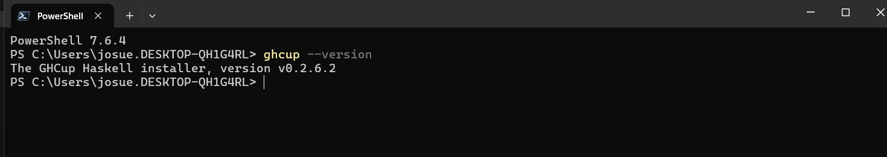
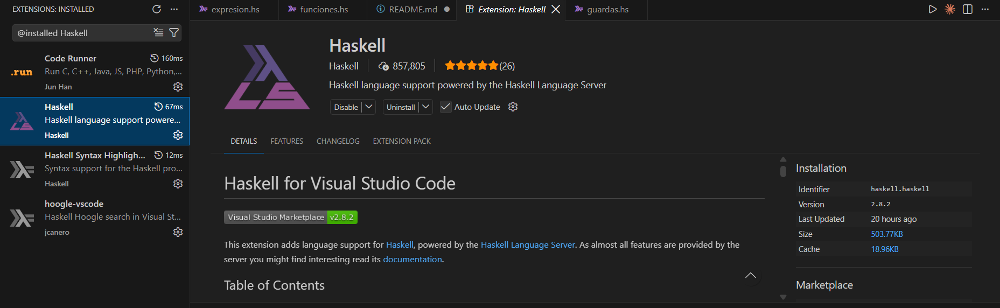

# Haskell — Grupo 10, Paradigmas de Programación

Exposición sobre el lenguaje **Haskell**, curso de Paradigmas de Programación.

**Integrantes:**
- Marisol Quirós Víquez
- Josué Sánchez Salazar


---

## Contenido de este repositorio

- Guía de instalación de Haskell (Windows)
- Guía de instalación de la extensión de Haskell para VSCode
- Ejemplos de código usados en la exposición (ver [Estructura del repositorio](#estructura-del-repositorio))
- Un juego de Tetris para la terminal

---

## Instalación de Haskell en Windows (GHCup)

GHCup es el instalador oficial recomendado para obtener GHC (el compilador de Haskell) y GHCi (su entorno interactivo).

### Pasos

1. Ingresa a la página oficial de Haskell: [haskell.org](https://www.haskell.org)
2. Abre **PowerShell como administrador**.
3. Copia y pega el siguiente comando en la terminal:

   ```powershell
   Set-ExecutionPolicy Bypass -Scope Process -Force;[System.Net.ServicePointManager]::SecurityProtocol = [System.Net.ServicePointManager]::SecurityProtocol -bor 3072; try { & ([ScriptBlock]::Create((Invoke-WebRequest https://www.haskell.org/ghcup/sh/bootstrap-haskell.ps1 -UseBasicParsing))) -Interactive -DisableCurl } catch { Write-Error $_ }
   ```

4. El proceso puede tardar varios minutos — es normal, no lo cierres.
5. Cuando se te pida autorización para guardar archivos en `C:\`, responde `Y` (o `y`) a todas las preguntas.
6. Al finalizar la instalación, verifica que todo quedó correcto ejecutando:

   ```powershell
   ghci --version
   ```

7. Si ves un número de versión, Haskell ya está instalado en tu equipo.



### ¿Los pasos no funcionaron?

Si tienes problemas con la instalación, puedes seguir este video tutorial más detallado:

[Video: Cómo instalar Haskell paso a paso](https://www.youtube.com/watch?v=kMY3bUVhE9g)

---

## Configuración en Visual Studio Code

Para programar y ejecutar Haskell directamente desde VSCode:

1. Abre VSCode y ve a la pestaña de **Extensiones**.
2. Busca la extensión llamada **Haskell** (publicada por *haskell.haskell*).
3. Instálala.
4. Con esta extensión podrás:
   - Escribir y resaltar sintaxis de Haskell.
   - Ejecutar y probar código directamente desde la terminal integrada de VSCode.
   - Ver errores y sugerencias en tiempo real.



---

## Estructura del repositorio

| Carpeta | Contenido |
|---|---|
| `Sintaxis/` | Ejemplos de la sintaxis básica de Haskell |
| `codigos_ejemplo/` | Programas de ejemplo: hola mundo, factorial, fibonacci, figuras y números aleatorios |
| `calculadora/` | Calculadora hecha en Haskell |
| `codigo_compilador/` | Ejemplo de compilación de un programa con GHC |
| `juego/` | Tetris para la terminal |
| `imagenes/` | Capturas usadas en este README |

---

## Compilador, intérprete y runghc

Haskell se puede ejecutar de tres formas. Todas vienen incluidas con GHC.

### Compilador: `ghc`

Traduce todo el programa a código de máquina y genera un ejecutable (`.exe` en Windows). Es más lento al empezar, porque primero compila, pero el programa corre rápido y se puede distribuir sin necesitar Haskell instalado.

```powershell
ghc -o programa archivo.hs    # compila y genera programa.exe
.\programa                    # ejecuta el programa
```

- `-o nombre` define el nombre del ejecutable.
- Sin `-o`, el ejecutable se llama como el archivo (`archivo.exe`).
- Genera también archivos intermedios (`.o` y `.hi`).
- `ghc -fno-code archivo.hs` solo revisa errores, sin generar nada.

### Intérprete: `ghci`

Es un entorno interactivo (REPL). Carga el código y lo evalúa sin generar un ejecutable. Sirve para probar funciones rápido y ver sus tipos.

```powershell
ghci archivo.hs
```

Dentro de GHCi:

| Comando | Qué hace |
|---|---|
| `:load archivo.hs` (o `:l`) | Carga un archivo |
| `:reload` (o `:r`) | Recarga el archivo después de editarlo |
| `:type expresión` (o `:t`) | Muestra el tipo de una expresión |
| `:info nombre` (o `:i`) | Muestra información de una función o tipo |
| `main` | Ejecuta la función `main` |
| `:quit` (o `:q`) | Sale de GHCi |

Ejemplo:

```
ghci> :t map
map :: (a -> b) -> [a] -> [b]
ghci> factorial 5
120
```

### `runghc`: ejecutar sin compilar

`runghc` ejecuta un archivo directamente, sin abrir GHCi y sin dejar un `.exe`. Usa el intérprete por debajo, así que se comporta como un script.

```powershell
runghc archivo.hs
```

Se puede escribir también como `runhaskell archivo.hs`.

### ¿Cuál usar?

| Herramienta | Comando | Genera `.exe` | Mejor para |
|---|---|---|---|
| Compilador | `ghc -o programa archivo.hs` | Sí | Programas finales y rápidos |
| Intérprete | `ghci archivo.hs` | No | Probar y explorar el código |
| runghc | `runghc archivo.hs` | No | Ejecutar un script una sola vez |

> Para programas con teclado o gráficos en la terminal, como el Tetris, usa el compilador. El intérprete y `runghc` ejecutan el programa más lento.

---

## Juego: Tetris

El juego está en `juego/tetris.hs` y usa solo la librería base de Haskell.

```powershell
cd juego
ghc -o tetris tetris.hs
.\tetris            # las piezas caen solas
.\tetris turnos     # modo por turnos: cae una fila por tecla
```

| Tecla | Acción |
|---|---|
| `a` / flecha izquierda | Mover a la izquierda |
| `d` / flecha derecha | Mover a la derecha |
| `w` / flecha arriba | Girar |
| `s` / flecha abajo | Bajar |
| Espacio | Caída rápida |
| `q` | Salir |

> Ejecútalo desde PowerShell, la terminal de VSCode o Windows Terminal. Las teclas se leen con `_kbhit`/`_getch`, por lo que solo funciona en Windows.

---

## Recursos adicionales

- [Sitio oficial de Haskell](https://www.haskell.org)
- [Documentación de GHCup](https://www.haskell.org/ghcup/)
- [HaskellWiki](https://wiki.haskell.org/)
